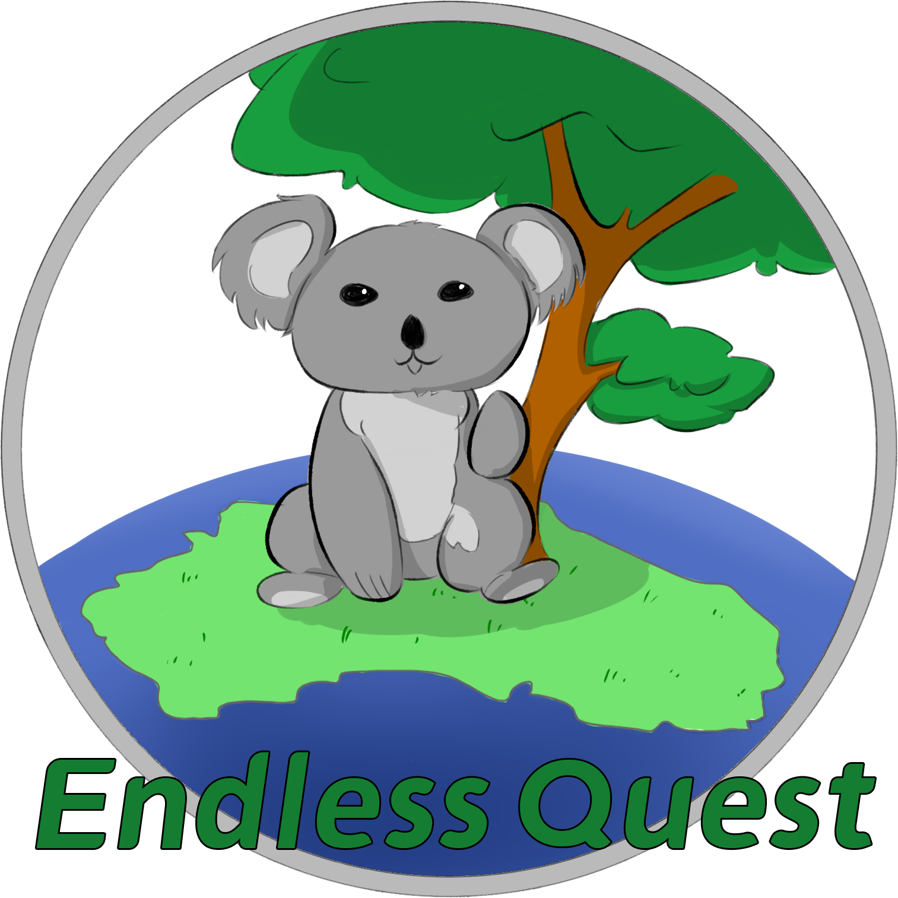
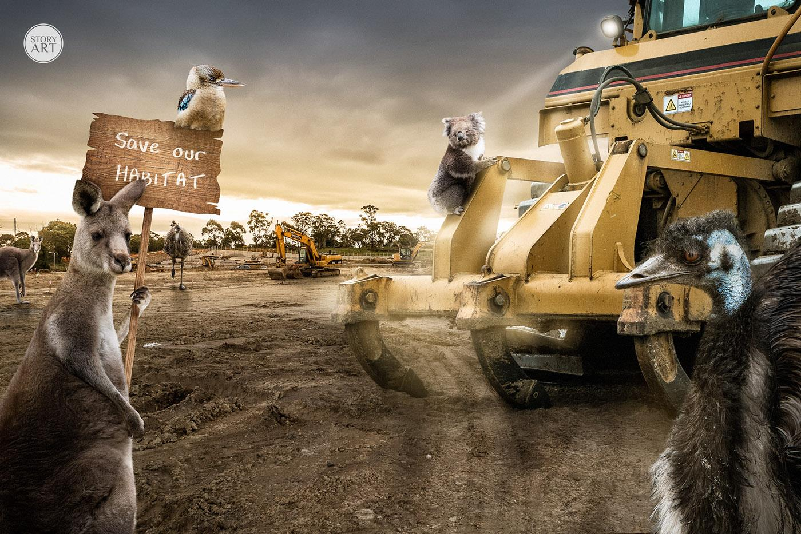
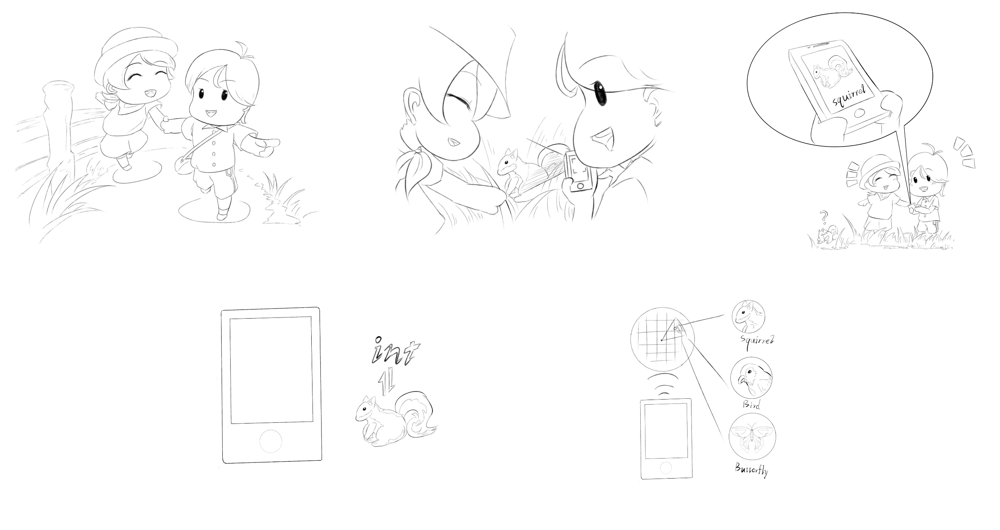
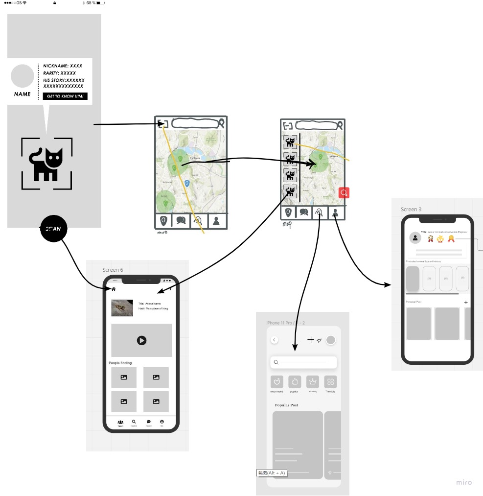

# Find your nature neighbors

  

[Link to project video](https://youtu.be/kQXjOrLSiK8)

## Design Background

  

Due to the deterioration of the environment, the occurrence of extreme weather is getting more frequently, which is closely related to continuous industrial development. It is due to the neglect of protection of the ecological environment that many species lost their habitat. Hence, how to awaken people to protect animals has become one of the essential issues in this era.

Compared to making the minds of adults change, cultivating the next generation, who represents the future, to respect the ecological balance is far more vital. Also, teenagers and children are more willing to accept some fresh thoughts. Hence, we devote ourselves to designing the app for the group of children and teenagers.

## What do we aim to do?

Our design aims to stimulate ACT youth's desire to explore nature, thus making them aware of the importance of protecting the plants and animals around them. Ultimately promoting a future where people and nature live in harmony.

Australia is a land that is famous for the biodiversity of both flora and fauna. However, some people, especially teenagers may know little concrete information about animals and plants. If they do not have basic knowledge of the species, it is quite hard to make them willing to have further ideas to protect the species.

## Why do we design it as a game?

  

Considering our target audience is a group of children and teenagers, we hold the view that the traditional mode of inputting knowledge, such as paper books or a visit to the museum, might not make them feel interested.

Combining the games with education may leave a deeper impression on them. Therefore, we will take gaming as the main function of the app, while education and social media can also be realized in it. Teenagers using the app can be close to nature, enrich knowledge about flora and fauna, learn about the propensity of endangered animals, and make friends with peers when using the application.

## Design Considerations
When designing this app we thought there were a few things to focus on：

1. Ensure that the geographic location of threatened animals is not exposed. We need to ensure that the habitat of threatened animals is not disturbed too much. This balance of exploration and conservation is key to ensuring that the game does not result in the man-made destruction of habitats of threatened animals and plants.

2. Ensure the simplicity of the interface and the ease of getting started.

3. Ensure the interface is interesting and interactive between users.

4. Ensure that the game style is fresh and simple, but there is no lack of contemporary sense, so that children and teenagers are accepted style interface.

5. Ensure that the science is authoritative as well as timely, so that young people and children can learn the right and interesting knowledge

## Low prototype of the App

  

## High Fidelity interface design

  

## About the datasets
- [Canberra Nature Map - ala.org.au](https://collections.ala.org.au/public/show/dr1947) is one of the basic datasets that we are necessary to utilize in this application. It is a repository for park care groups, volunteers and members of the public to report sightings of rare and endangered plant species and any of the many treasures in Canberra's nature parks. In our design, a map with the placement of endangered species is necessary because the user needs to be instructed to find the endangered species in a certain area. This dataset provides us with valuable information about the endangered plants. Then, the potential area where the endangered plants emerge will be demonstrated on the map, which brings a larger possibility for the users to find the plants.

-  [Canberra Nature Map](https://canberra.naturemapr.org/) brings us partial inspiration. It is a forum for amateurs who are interested in animals and insects. Bloggers capture pictures of animals and uploaded them on this website. Also, it provides the user with the potential location where the species live. It seems that adults are the main audience of this website. However, we believe that teenagers can also participate in this activity. We design the app in a bright colour to attract teenagers. At the same time, capturing the flora and fauna in a game mode can make teenagers feel not bored. Our design aims to combine the education of common knowledge with gaming.

- [Canberra Nature Map](https://www.data.act.gov.au/dataset/Threatened-Fauna-Habitat/dkn6-f5xe) provides another part of biological information about the fauna to us. This dataset shows the habitat/locations of mammals listed as threatened in the ACT. With this dataset, we can collect the potential locations of the threatened animals. In the same way, the area will be marked or noted on the map of our application. The name of the species is also presented in the dataset, their name can also be searched in our search function. Hence, this dataset plays an important role in our design.

- [Risk to Biodiversity in the Wadeye Area, 2021](https://data.nt.gov.au/dataset/risk-to-biodiversity-in-the-wadeye-area-2021)
This dataset provides us with valuable information about endangered plants and animals. Potential areas where endangered plants occur are displayed on the dataset. Combined with a database of information on the location of harmful plants, the application will allow users to show which plants and animals are around them, which of these plants and animals are endangered and which are harmful to the environment.

- [NT Weed Records (points)](https://data.nt.gov.au/dataset/nt-weeds) By connecting to this database, the app can automatically report to the relevant department if the location of the user uploading new discovery weeds is not in the discovery record. The relevant department can decide whether to update the location information of weeds in the database based on the reliability of the information uploaded by the user.

- [Proportion of pre-clear threatened fauna habitat that is remnant vegetation](https://www.data.qld.gov.au/dataset/soe2020-threatened-fauna-species-habitat/resource/2020-indicator-1-4-1-3) By comparing the species of threatened animals in this database with the Database of species in Queensland, it is possible to more quickly filter out which species are threatened in Queensland and to mark a more comprehensive range map. To avoid disturbance of these habitats, there are no rewards in the app for scanning rare animals in the habitat, and a pop-up message about legal action for harming rare animals.

- [Database of species in Queensland](https://bie.ala.org.au/search?fq=rank%3A%22species%22&sortField=score&dir=desc&q=queensland+species) Load the database of the council where the user is currently located by changing the location information based on their location. If the user is in Queensland, then the Database of species in Queensland will be loaded, so that the user can know what animals are around them and their approximate habitat range even in Queensland. Users can also send information about the species they have scanned and its habitat to the relevant authorities for them to update the Database of species in Queensland.

Combined with these databases, it is possible to build a network of games throughout Australia. No matter where the user is, he or she can point to what plants and animals are around and what plants and animals are threatened or harmful in the surrounding area, and such a design will enable all children and young people in Australia to participate in this game. Sharing among friends and updates from people can increase the attention of the game in the community, and make people understand that these plants and animals, which are usually found in encyclopedias, may be just next to us.
