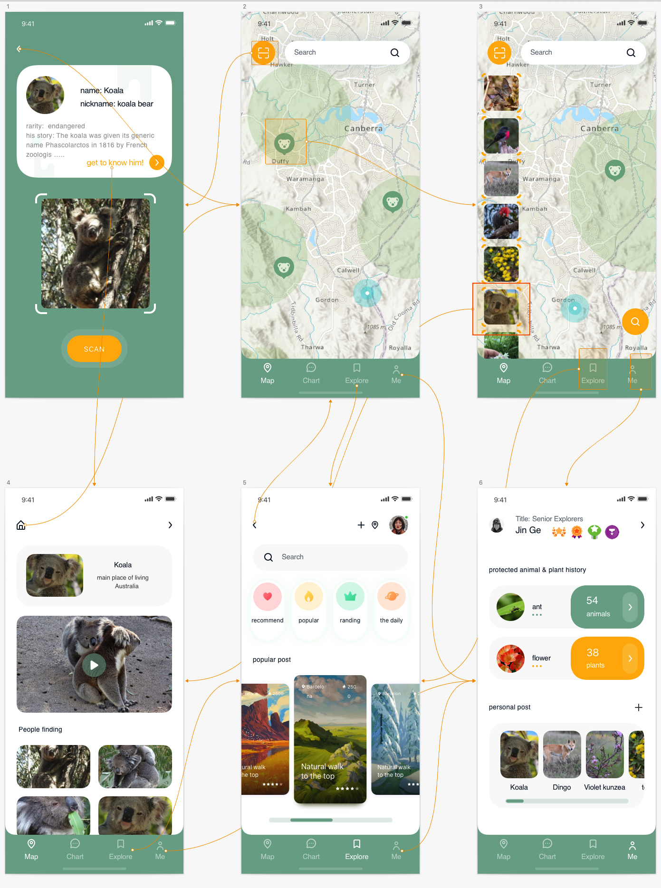

# Find your nature neighbors

[Link to project video](https://youtu.be/)

## Design Background

  

Due to the deterioration of the environment, the occurrence of extreme weather is getting more frequently, which is closely related to continuous industrial development by human beings. It is due to the neglection of protection to the ecological environment that many species lost their habitat. Hence, how to awaken people to protect animals has become one of the essential issues in this era.

Compared to making the minds of adults change, cultivating the next generation, who represents the future, to respect the ecological balance is far more vital. Also, the teenager and children are more willing to accept some fresh thoughts. Hence, we devote ourselves to designing the app for the group of children and teenagers.

## What we aim to do?

Our design aims to make ACT teenagers be aware of protecting the Flora and Fauna around them and promote the concept of harmonious coexistence between people and nature.

Australia is a land which is famous for the biodiversity of both flora and fauna. However, some people, especially teenagers may know little about the concrete information of the animals and plants. If they do not have basic knowledge of the species, it is quite hard to make them be willing to have further ideas to protect the species. 

## Why we design it as a game?

  

Considering our target audience is the group of children and teenager, we hold the view that the traditional mode of inputting knowledge, such as paper books or a visit to museum, might not make them feel interested.

Combining the games with education may leave a deeper impression on them. Therefore, we will take gaming as the main function of the app, while education and social media can also be realized in it. Teenagers using the app are able to be close to the nature , enrich knowledge about flora and fauna, learn the propensity of endangered animals and make friends with peers when using the application.  

## Low prototype of the App

  

## High Fidelity interface design

  

